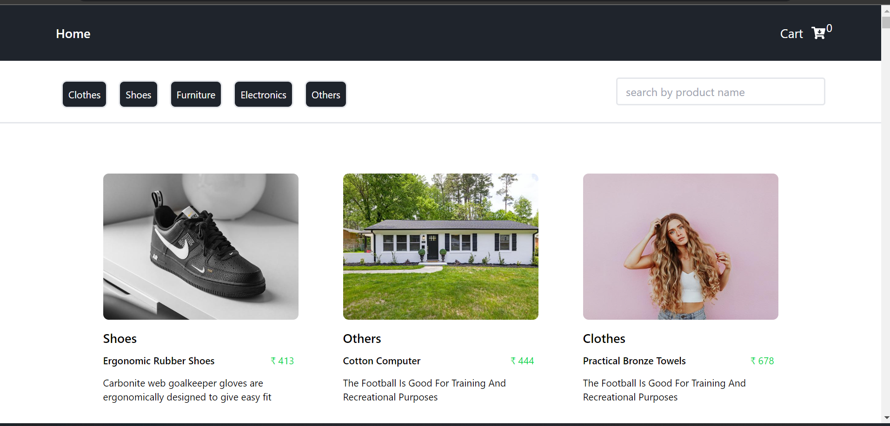

## **Using Technology**

## **Problem Statement of the E-Commerce application clone .**

### An E-commerce application is a place where user can see the collection of products and filter the product category , search for the product title and last one add the product to the cart and user can delete individual item in cart, and place order.
 
## 🚀 [LiVE PROJECT LINK](https://coruscating-biscotti-cd60f8.netlify.app/) 

